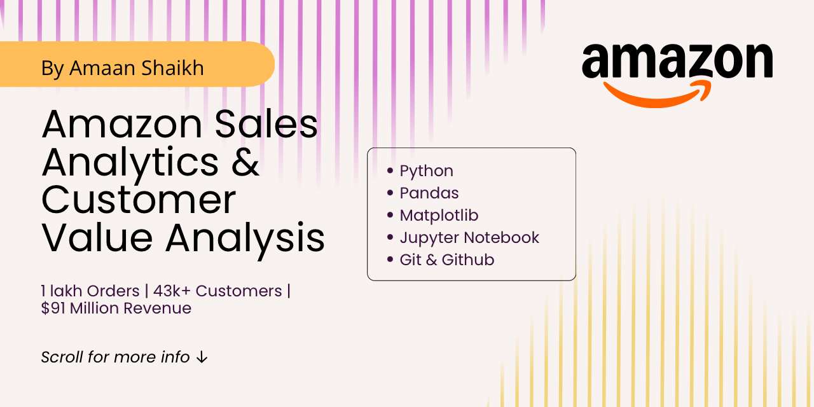
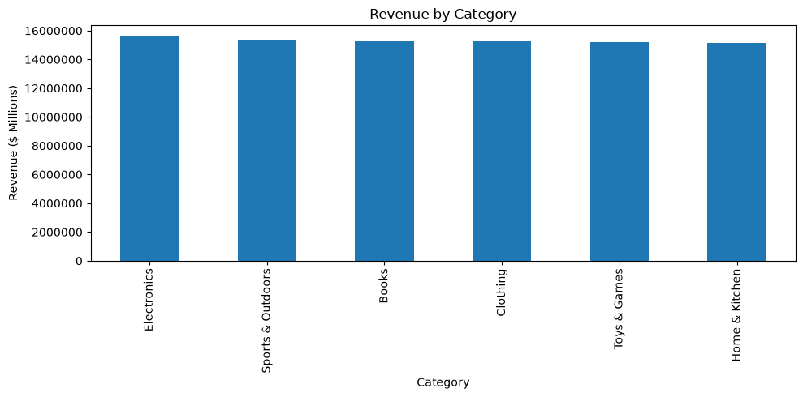
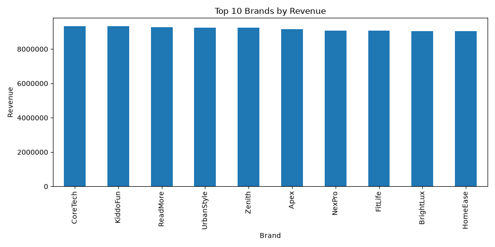
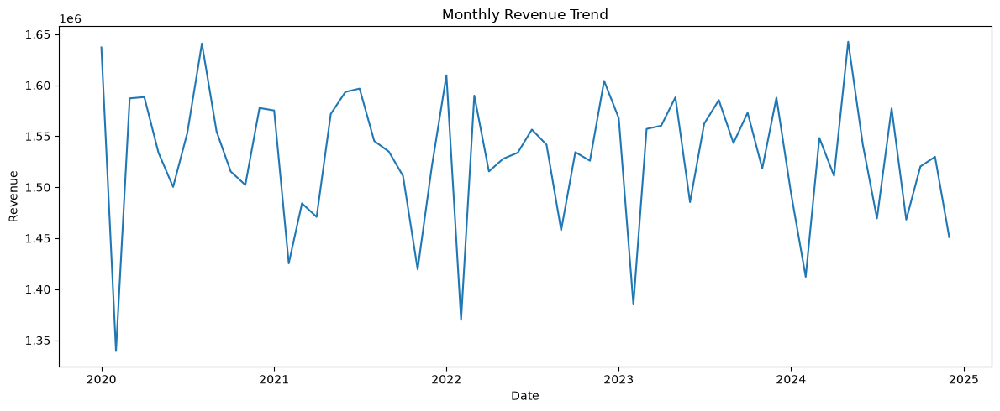
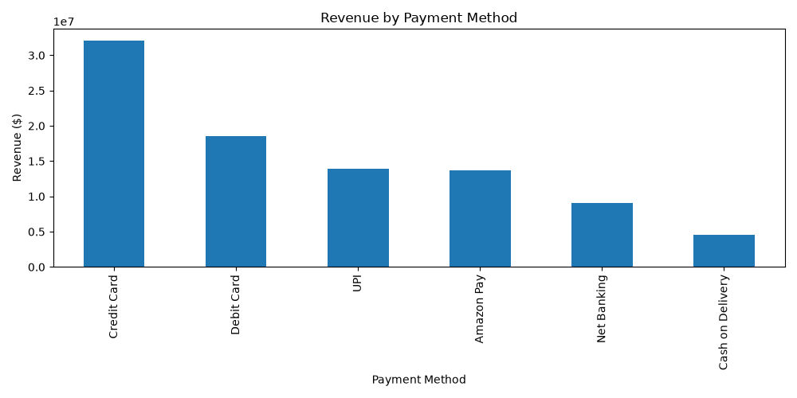
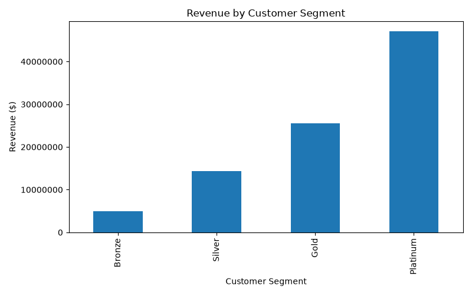

<p align="center">
  
</p>

<h1 align="center">
Amazon Sales Analytics & Customer Value Analysis
</h1>

<p align="center">
Customer Segmentation • CLV Analysis • Revenue Insights • Business Intelligence
</p>

# 📈 Amazon Sales Analytics & Customer Value Analysis

## Project Overview

This project analyzes 100,000 Amazon sales transactions to uncover revenue trends, customer purchasing behavior, payment preferences, and customer lifetime value.

The objective was to transform raw sales data into actionable business insights that can support strategic decision-making and improve customer retention.

---

## Key Results

- 💰 Total Revenue: $91.8M
- 🛒 Total Orders: 100,000
- 👥 Customers Analyzed: 43,233
- 💳 Top Payment Method: Credit Card ($32.1M)
- 📍 Top Revenue State: Texas ($22.8M)
- 🏆 Highest Customer Segment Revenue: Platinum ($47M)

---

## Business Questions Addressed

- Which product categories generate the most revenue?
- Which brands contribute the highest sales?
- How does revenue change over time?
- Which payment methods are most preferred?
- Who are the highest-value customers?
- How can customers be segmented for targeted marketing?

---

## Technologies Used

- Python
- Pandas
- NumPy
- Matplotlib
- Jupyter Notebook
- Git & GitHub

---

## Project Workflow

### 1. Data Understanding

- Reviewed dataset structure
- Examined data types
- Identified key business variables

### 2. Data Cleaning

- Checked missing values
- Verified duplicates
- Converted date columns

### 3. Exploratory Data Analysis

- Revenue Analysis
- Category Analysis
- Brand Analysis
- Geographic Analysis
- Payment Analysis

### 4. Customer Value Analysis

- Customer Lifetime Value (CLV)
- Revenue Distribution
- Customer Segmentation

### 5. Data Visualization

- Revenue Trends
- Category Performance
- Brand Performance
- Payment Analysis
- Customer Segmentation

---

## Key Insights

### Revenue Performance

- Generated $91.8M in total sales revenue.
- Average Order Value was $918.26.

### Customer Insights

- Platinum customers generated over $47M in revenue.
- Top customers contributed significantly to overall sales.

### Geographic Insights

- Texas generated the highest revenue.
- Dallas ranked among the strongest-performing cities.

### Payment Insights

- Credit Cards generated the highest transaction revenue.
- Digital payment methods showed strong adoption.

---

## Business Recommendations

1. Strengthen loyalty programs for Platinum customers.
2. Develop targeted campaigns for Gold customers.
3. Expand premium product offerings in high-performing regions.
4. Increase focus on digital payment incentives.
5. Optimize inventory around top-performing categories and brands.

---

## Visualizations

### Revenue by Category



### Top Brands by Revenue



### Monthly Revenue Trend



### Payment Method Revenue



### Customer Segment Revenue



---

## Project Structure

```text
amazon-sales-analytics-customer-value-analysis/

├── README.md
├── requirements.txt
├── data/
├── notebooks/
├── images/
```

---

## Skills Demonstrated

- Data Cleaning
- Data Analysis
- Exploratory Data Analysis (EDA)
- Customer Lifetime Value Analysis
- Customer Segmentation
- Business Intelligence
- Data Visualization
- Business Recommendations
- GitHub Project Management

---

## Author

**Amaan Shaikh**

Aspiring Data Analyst | Marketing Analytics | Python | SQL | Power BI
